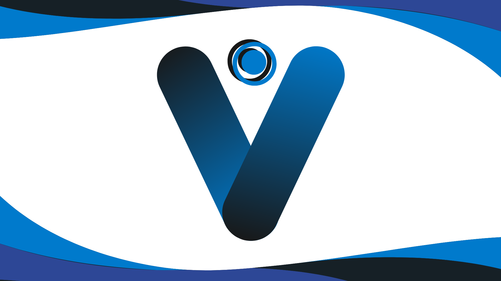

# VERITAS CODE - A Lite Code IDE

 


An ultra lightweight, zero-lag, and locally run code editor for all 3 major operating systems, boasting minimal RAM footprint. It is fast, snappy and reliable. This can be used as a lite alternative to VS Code, Atom, Sublime Text if you don't need extensions. (Extension Marketplace will be added soon in v3.0)

> This is a brief introduction to this project. To see examples, details, project explainations and implementation, refer to [Here](workflowandcontext.md)

## Trademark and Copyright infringement prevention

This is not in any way a tutorial, or a copy of any other 'editor', 'brand' or 'product'. Any similarities are purely coincidental. The author will NOT be held responsible for any forks or copies of this software which may immitate any of the above mentioned items.



## FEATURES

1. Native Dark Mode throughout the app
2. Sidebar and toolbar similar to popular IDEs 
3. Very small size and RAM footprint
4. Custom indentation for each Language

## HIGHLIGHTS

1. Can be run on all devices, from old legacy devices to modern powerhorses
2. Can be used on Localhost, natively as a Webapp, or a full-pledged windows app
3. Data stays on your Drive (Your WIFI company may still get the metadata during localhost use)

## SHORTCUTS

| Shortcuts | Description |
|:---:|:---:|
| Ctrl + N | New File |
| Ctrl + Shift + N | New Window |
| Ctrl + O | Open File |
| Ctrl + K + O | Open Folder |
| Ctrl + S | Save File |
| Ctrl + Shift + S | Save As |
| Alt + Shift + S | Save Copy As |
| Ctrl + P | Print Window |
| Ctrl + X | Cut Text |
| Ctrl + C | Copy Text |
| Ctrl + V | Paste Text |
| Ctrl + A | Select All Text |
| Ctrl + Z | Undo edit |
| Ctrl + Y | Redo edit |
| Ctrl + ` | Open Terminal |

## DEPENDENCIES

- Python 3.8+ (3.13+ recommended)
- Flask (Non-Negotiable)
- Pywebview (For PWA)
- Pyinstaller (For Windows Application)
- Bash (required for Linux / Mac, highly recommended for Windows)

## INSTALL DEPENDENCIES

```
pip install -r requirements.txt
```

## HOW TO USE

### 1. Windows Application (Recommended for all windows users)

1. Download the latest release from [here](https://github.com/VeritasSoftware/veritas-code/releases)

(comming soon...)

### 2. Progressive Webapp (Recommended for Linux / Mac users)

1. Download the codebase.
2. Run Bash or Cmd in root directory of the codebase.
3. install the dependencies
4. run 'launcher.py' to launch the PWA (entire codebase should be downloaded to prevent any errors)

```
cd path/to/root/directory
python launcher.py
```
