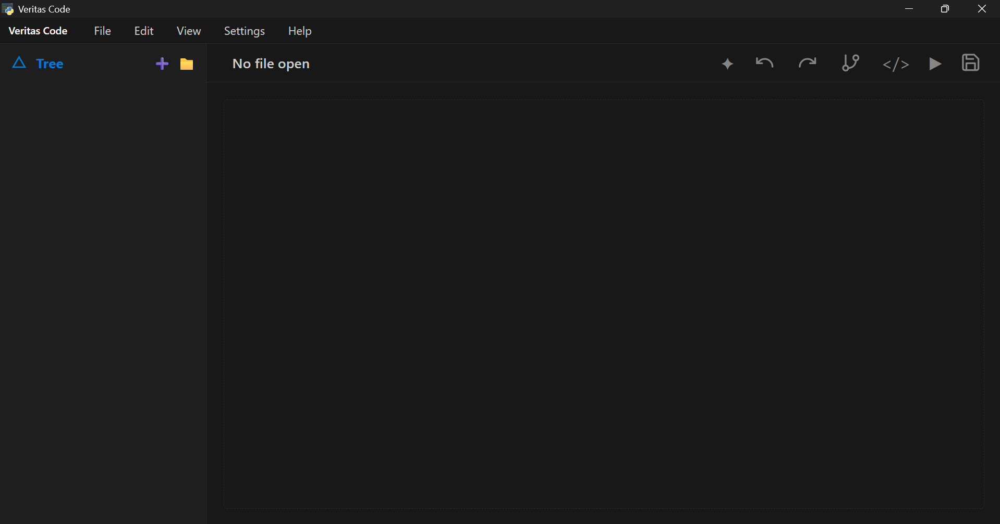
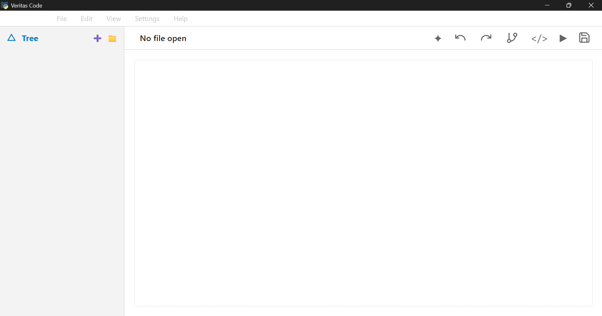
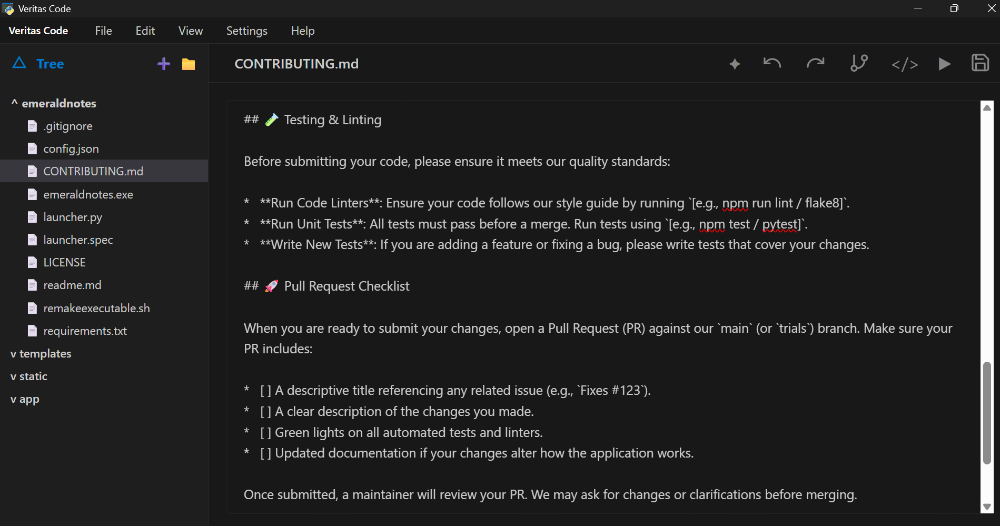

# Veritas Code - Project Context & Architecture

This document serves as the absolute source of truth for the Veritas Code application. If context is lost or state needs to be rebuilt from scratch, this document contains all specifications, exact project layouts, file contents, and logic required to restore the app.

---

## EXAMPLES

### 1. Homepage: Dark mode (default)


### 2. Homepage: Light mode


### 3. During Working Session 


## 1. Project Directory Structure

```
root-folder/
├── app
    └──app.py              # Flask server, API endpoints, platform integration
    └──init__.py
├── formatting.py          # Code formatting and HTML-to-text extraction helpers
├── templates/
│   └── index.html         # Main UI workspace layout
└── static/
    └── css/
        └── style.css      # Themes, colors, light/dark mode
    └── js/
        └── main.js        # Event listeners, shortcut handler, tree UI, editor engine
└──launcher.py             # launches webapp natively using pywebview
└── FAOs.md
└── LICENSE.md
└──setupandusage.md
```


## 2. Core Functional Requirements & Rules

### Editor Text Formatting and Canvas:

1. Monaco Editor integration (@main.js)

### AI Integration:

1. Built an API/Local Model configuration panel (@apiform.html) with:

- sanitized inputs
- folder scanning for local models
- persistent floating popup window.

### Theme & Colors:

1. Dark background theme matching VS Code design language (#181818 app background, #1e1e1e sidebar).

1. Accents use VS Code Blue (#007acc / #0098ff). Accent green is strictly replaced by VS Code blue.

1. Text colors: Main text #cccccc, muted text #858585.

### Layout:

#### Top Header:

1. Standard application bar containing File, Edit, View, Settings, Help (left intact as standard menu items).

#### Sidebar:

1. Clickable Notes title in sidebar header collapses the sidebar down to an icon-only strip.

1. Clicking the Logo Icon when collapsed expands the sidebar back out.

1. Opening directories updates the root folder display directly in place of the default tree header.

### Workspace Canvas:

The workspace grid contains a dynamically sizing textCanvas element (contenteditable="true" or editable container).
Displaying loaded file names: The header bar above the text canvas (#activeFileName) dynamically shows the name of the file currently opened.

### File Opening Behavior (Native Python Tkinter Dialogs):

File Extension Whitelist: Only plain text / code files are rendered inside the editor.
Allowed extensions: txt, md, js, ts, html, css, json, yaml, yml, py, c, cpp, java, sh.
Non-code files (images, .pdf, .docx, binary, etc.) are ignored and will not open inside the canvas.
Loaded text content populates directly into .text-canvas without opening browser tabs or raw file:/// URLs.


## Tech Stack & Dependencies

* **Backend:** Python 3 (Flask)
* **Frontend:** Plain JavaScript (ES6+), HTML5, CSS3
* **Native Application Wrapper:** `pywebview`
* **Dependencies (`requirements.txt`):**
```
Flask>=3.0.0
pywebview>=4.0.0
Pyinstaller>=5.9.0
```

## API Endpoints (`app.py`)

* `GET /`: Serves `index.html`.
* `POST /format-content`: Formats code strings based on file extension.
* `POST /read-file`: Reads text files from disk (restricts `.git` directories).
* `POST /save-file`: Writes modified editor content back to disk.
* `POST /create-file`: Creates an empty file in the targeted workspace folder.
* `POST /create-folder`: Creates a new directory.
* `POST /run-file`: Executes `.py`, `.js`, or `.sh` files via subprocess.
* `POST /open-terminal`: Launches local shell environment. Resolution hierarchy:
1. System `bash` (if available in PATH)
2. `git-bash.exe` (searches common Windows installation paths)
3. System default fallback (`cmd` on Windows, native terminal on macOS/Linux)


---

## Workspace Features & Keyboard Shortcuts

* **Indentation Handling:** Tab key defaults to 2 spaces for web formats (`html`, `css`, `json`, `yaml`, `js`, `ts`) and 4 spaces for other languages.
* **Security Constraints:** Access or modification of `.git` files and subdirectories is strictly prohibited across all endpoints.

### Configured Keyboard Shortcuts (`static/js/main.js`)

| Shortcut | Action | Implementation |
| --- | --- | --- |
| `Ctrl + N` | New file in root/target directory | Triggers `➕` sidebar button or fallback prompt |
| `Ctrl + Shift + N` | Fresh window ("No file open") | Resets active file state and clears editor canvas |
| `Ctrl + `` | Open default Bash or CMD terminal | Calls `POST /open-terminal` |
| `Ctrl + S` | Save active file | Calls `POST /save-file` |
| `Ctrl + Z` | Undo inside editor | Executes `document.execCommand('undo')` |
| `Ctrl + Y` | Redo inside editor | Executes `document.execCommand('redo')` |
| `Ctrl + X` | Cut selected text | Executes `document.execCommand('cut')` |
| `Ctrl + C` | Copy selected text | Executes `document.execCommand('copy')` |
| `Ctrl + V` | Paste copied text | Standard native canvas paste |
| `Ctrl + K` -> `Ctrl + O` | Open directory picker | Triggers folder input picker |
| `Ctrl + O` | Open single file picker | Triggers file input picker |
